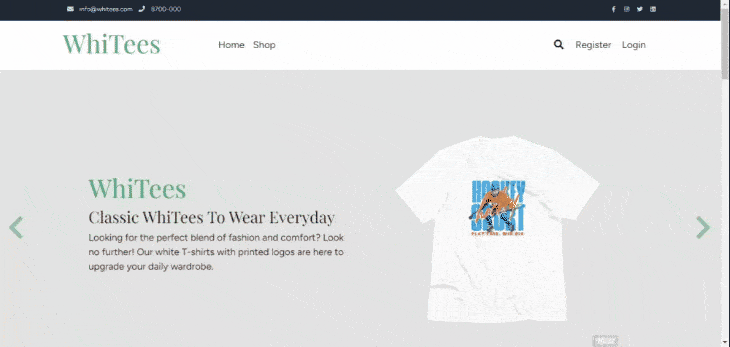

#### Visit the live link on **https://whitees.fly.dev**

## How I worked on this project

My goal is to simulate building real-world web applications.

- I used feature branches and Pull Requests: [Example PR](https://github.com/cathleys/whitees/pull/7)

## How to navigate this project

- Somewhat complex application logic: [Example code](https://github.com/cathleys/whitees/blob/order-page/Repositories/ShoppingCart.cs)
- This app implements Repository & Unit of Work pattern: [Example database call](https://github.com/cathleys/whitees/blob/order-page/Repositories/ShirtRepository.cs) [Unit of Work](https://github.com/cathleys/whitees/pull/14/commits/c8d7131f3c2eb33d6374d7003bfd50679d27a254)
- CI/CD pipeline : [Example image](wwwroot/assets/img/cd.JPG)

## Why I built the project this way

C# is a great object-oriented and type-safe programming language. C# enables developers to build many types of secure and robust applications that run in .NET.

ASP.NET Core MVC is a great web framework to build dynamic web apps and help developers to build them quicker and more efficiently.

## If I had more time I would change this

- Create partial views for the link elements on the home page.
- If I had more time, I would also try to build this with .NET Core Web API and/or Blazor.

\***\*\*\*\*\***The End\***\*\*\*\*\*\***

## The Application

WhiTees is an online shopping website where you can purchase cool white shirts.



## Getting Started

This project is built with ASP.NET Core MVC, C#, HTML, CSS, Bootstrap, Javascript.

1. Go into directory where you plan on keeping project and run.

```bash
  git fork https://github.com/cathleys/whitees.git
```
